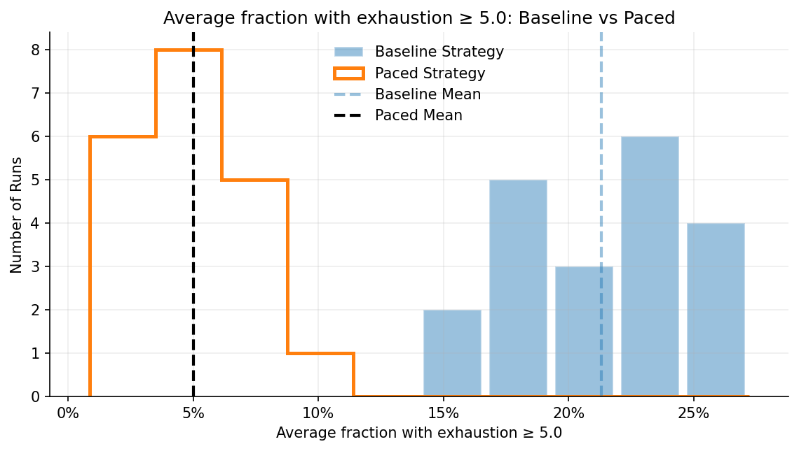

# Concert Crowd Simulation

Agent-based / cellular automaton simulation of crowd dynamics in a concert pit.

The model explores how local interactions, attraction to the stage, song energy, and individual behavior produce emergent patterns such as high-density regions and mosh-pit-like motion, while tracking exhaustion as a safety-related metric.

## Simulation preview

### High-energy song demo

### Example concert segment (song energy bands + exhaustion)

## Results: Baseline vs Paced setlist
A simple “paced” setlist policy (inserting cooldown / lower-energy songs after high-energy songs) reduces the average fraction of the crowd above an exhaustion threshold.

## Contents
- `concert_crowd_simulation.ipynb` — main simulation notebook
- `assets/` — GIFs and figures used in this README

## What this project demonstrates
- Agent-based modeling
- Complex systems and emergent behavior
- Simulation design in Python
- Jupyter notebooks for computational experiments
- Simple policy comparison via Monte Carlo runs (baseline vs paced)

## How to run
1. Create/activate a Python environment (venv/conda).
2. Install deps (typical):
   - `numpy`, `matplotlib`, `pandas`, `tqdm`, `pillow`, `jupyter`
3. Run the notebook:
   - `concert_crowd_simulation.ipynb`

## Context
Final project for **CS166 – Modeling & Analysis of Complex Systems** (Minerva University).